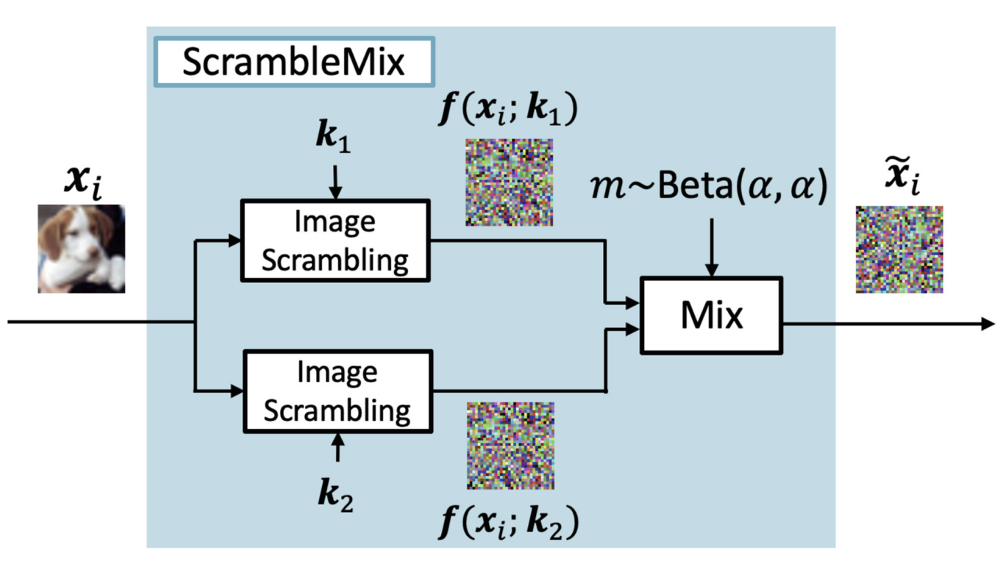
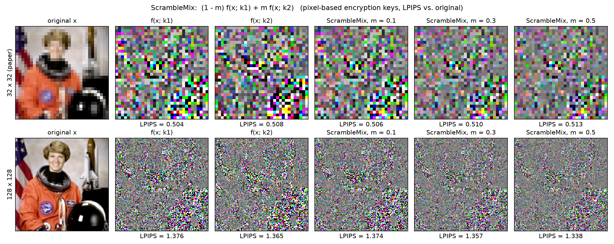

# ScrambleMix: A Privacy-Preserving Image Processing for Edge-Cloud Machine Learning

Official PyTorch implementation of the paper *ScrambleMix: A Privacy-Preserving Image Processing for Edge-Cloud Machine Learning* (PSIVT 2023).

[Koki Madono](https://madonokouki.github.io/)<sup>1</sup>, Masayuki Tanaka<sup>2,3</sup>, Masaki Onishi<sup>2</sup>
<br><sup>1</sup>Waseda University, <sup>2</sup>AIST, <sup>3</sup>Tokyo Institute of Technology

[](https://madonokouki.github.io/projects/scramblemix/)
[](https://doi.org/10.1007/978-981-97-0376-0_25)
[](psivt.pdf)
[](LICENSE)
[](https://www.python.org/)
[](https://pytorch.org/)
[](https://github.com/MADONOKOUKI/psivt23_scramblemix/actions/workflows/tests.yml)
[](https://colab.research.google.com/github/MADONOKOUKI/psivt23_scramblemix/blob/main/notebooks/quickstart.ipynb)

<p align="center"></p>

**TL;DR.** Before an image leaves the edge device, ScrambleMix scrambles two copies of it with the two
secret keys of a key pair and blends them, `x~ = (1 - m) f(x; k1) + m f(x; k2)` with `m ~ Beta(α, α)`.
The cloud classifier is trained on several such views per image with cross-entropy plus a
*self-teaching loss* that pulls the predictions of the differently keyed views together, and at test
time it can average the predictions for several key pairs. On CIFAR-10/100 and SVHN this is more
accurate than plain image scrambling (LE, random PE), DataMix and InstaHide in most settings, and the
InstaHide attack recovers much less from it (slides 39-41 of [`psivt.pdf`](psivt.pdf)).

## News

- 2026-10: Code refactored into an installable package with a Colab quick start; the original research code is kept in [`archive/`](archive/).

## Installation

```bash
git clone --depth 1 https://github.com/MADONOKOUKI/psivt23_scramblemix.git
cd psivt23_scramblemix
pip install -e .
```

or, to use only the library: `pip install git+https://github.com/MADONOKOUKI/psivt23_scramblemix`.
Requires Python >= 3.9 and PyTorch >= 1.13; runs on CUDA, Apple MPS or CPU.

## Quick start

```python
import torch
from PIL import Image
from torchvision import transforms
from scramblemix import ScrambleMix, ScrambleMixViews, scramblemix_loss, predict_tta

sm = ScrambleMix.random(num_pairs=4, key_seed=0)   # secret key set: 4 key pairs, kept on the edge side
x_tilde = sm(Image.open("photo.png").convert("RGB").resize((32, 32)))  # one view: float tensor [3, 32, 32]

# training: one view per key pair (D = 4); a DataLoader over a dataset with this transform
# yields `views` of shape [B, 4, 3, 32, 32] and `labels` of shape [B]
train_tf = transforms.Compose([transforms.RandomCrop(32, 4), transforms.RandomHorizontalFlip(), ScrambleMixViews(sm)])
logits = torch.stack([model(views[:, d]) for d in range(views.shape[1])])  # [D, B, num_classes]
loss = scramblemix_loss(logits, labels, lam=1.0)   # cross-entropy + self-teaching loss

# inference on clean images [B, 3, 32, 32] in [0, 1]: scramble with T = 4 key pairs and average
pred = predict_tta(model.eval(), images, sm, num_keys=4).argmax(1)
```

`ScrambleMix` is a torchvision-style transform: it takes PIL images, `[H, W, 3]` numpy arrays or
`[3, H, W]` / `[B, 3, H, W]` tensors and returns float tensors in `[0, 1]`. `seed=` makes the sampling
of key pairs and `m` reproducible, and DataLoader workers always get independent random streams.
`ScrambleMix.original("cifar10")` loads the exact key set of the paper's code, `sm.save(path)` /
`ScrambleMix.load(path)` store a key set, and the scrambling functions are available on their own as
`PixelEncryption` and `LearnableEncryption`. `lpips_distance(original, scrambled)` measures visual
information hiding.

```bash
python examples/quickstart.py   # a few seconds on a CPU, no dataset (LPIPS fetches AlexNet weights once)
```



*Output of `examples/quickstart.py`: an image scrambled with the two keys of a pair and mixed with
m = 0.1 / 0.3 / 0.5 (the ratios shown on slide 42). The LPIPS values are computed by the script for this
one image (higher = less visual information); they are not results from the paper.*

A Colab version with a small training example is in [`notebooks/quickstart.ipynb`](notebooks/quickstart.ipynb).

## Reproducing the paper

```bash
bash scripts/reproduce_accuracy.sh   # ScrambleMix rows of the accuracy tables (slides 39 and 40)
bash scripts/reproduce_lpips.sh      # LPIPS of PE / LE / ScrambleMix scrambled test images
bash scripts/smoke_test.sh           # pipeline check on synthetic data (random labels), no download
```

Each command in `reproduce_accuracy.sh` trains one model, which gives one cell of slide 39 (T = 1) and
the matching cell of slide 40 (T = 4), e.g.

```bash
python train.py --dataset cifar10 --model shakedrop     # Shakedrop, CIFAR-10
python train.py --dataset svhn    --model wrn40_2       # WideResNet, SVHN
```

The defaults of `train.py` are the paper setting of the original code (`archive/scripts/scramblemix/main_paper.sh`):
pixel-based encryption with the original keys (four key pairs per dataset), D = 4 views per image,
`m ~ Beta(5e-3, 5e-3)`, self-teaching loss weight 1, SGD (lr 0.1, momentum 0.9, weight decay 5e-4),
batch 256, 200 epochs with the learning rate divided by 10 at epochs 60, 120 and 180. CIFAR-10/100 and
SVHN are downloaded to `--data-root` (default `./data`). A run writes `metrics.csv`, `last.pt` (resume
with `--resume`), `keys.pt` and `final.json`, where `test_acc_single_mean` is the accuracy with one
view and a random key pair (T = 1, slide 39) and `test_acc_tta_mean` the accuracy when the logits of
the four key pairs are averaged (T = 4, slide 40), both averaged over ten evaluations of the final
model. Every training step runs D forward/backward passes, so a run costs about four times a standard
CIFAR training run; use a CUDA GPU (PyramidNet-110 with ShakeDrop has 28.5M parameters).

Useful options: `--views D`, `--tta T`, `--alpha`, `--lambda-st 0` (cross-entropy only),
`--scheme le` (block-wise learnable encryption instead of pixel-based encryption), `--keys random --key-seed S`,
`--tta-reduction probs`, `--no-mix` (plain single-key scrambling), `--eval-only --resume <ckpt>`,
`--dataset fake` (synthetic data for smoke tests). See `python train.py --help`.

Only the ScrambleMix rows can be reproduced with this repository: the original release contains no
training code for the DataMix, InstaHide, LE and Random PE baselines (`--no-mix --views 1 --tta 1`
trains a single-key scrambling classifier with the same pipeline, but it was not checked against the
paper's baseline numbers), nor for the InstaHide-attack evaluation of slides 41-42. The LPIPS values of
the paper are not in the public slides; `evaluate_lpips.py` computes them for the three scrambling methods.

<details>
<summary><b>Paper vs. original code: what this implementation follows</b></summary>

Where the slides and the original code differ, the code that produced the paper's numbers is followed
(details in [`archive/README.md`](archive/README.md)):

- **Keys.** The original code uses a fixed secret set of eight pixel-based encryption keys per dataset,
  paired as (0, 1), (2, 3), (4, 5), (6, 7); every view gets a new `m`. The keys are shipped verbatim
  (`ScrambleMix.original(dataset)`, `--keys original`).
- **Mixing ratio.** `alpha = 5e-3`, so `m` is almost always close to 0 or 1 (about 2 % of the draws lie in (0.01, 0.99)).
- **Pixel-based encryption.** The original colour-channel shuffle assigns channels in place, so five of the
  six shuffle codes duplicate a channel instead of permuting it. `PixelEncryption(channel_mode="original")`
  (default) reproduces this bit for bit; `channel_mode="permutation"` is the invertible textbook version.
- **WideResNet.** The slides label the network "WideResNet40x10"; the original code builds
  `WideResNet(depth=40, widen_factor=2)`. `--model wrn40_2` follows the code; `--model wrn40_10` is also available.
- **Self-teaching loss.** The code adds `1/D sum_d KL(p_d || mean_d p_d)` with weight 1 and no stop-gradient,
  the slides write a stop-gradient on the mean; both have the same value and gradient (tested).
- **TTA.** The code averages logits, the slides average posteriors (`--tta-reduction probs`).
- **Input range.** The original fed scrambled images in [0, 255]; here they are in [0, 1]. All networks start
  with convolution + batch normalisation, so this does not change training (up to BatchNorm's epsilon).
- **Schedule.** The original stepped the scheduler at the start of each epoch (decaying one epoch before each
  milestone with PyTorch >= 1.1); `train.py` steps it after each epoch.
</details>

## Results

Numbers from the PSIVT 2023 presentation slides, [`psivt.pdf`](psivt.pdf) (the paper itself is
[paywalled](https://doi.org/10.1007/978-981-97-0376-0_25)). Accuracy in %, best per column in bold.

**Test accuracy without test-time augmentation (T = 1)** -- slide 39.

| WideResNet (slide: "WideResNet40x10") | CIFAR-10 | CIFAR-100 | SVHN |
|---|---:|---:|---:|
| DataMix | 66.89 | 38.31 | 19.60 |
| InstaHide | 53.58 | 39.06 | 52.47 |
| LE | 91.34 | 70.62 | 96.50 |
| Random PE | 92.23 | 70.82 | 96.83 |
| **ScrambleMix (proposed)** | **93.08** | **71.71** | **96.96** |

| Shakedrop | CIFAR-10 | CIFAR-100 | SVHN |
|---|---:|---:|---:|
| DataMix | 80.10 | 50.97 | 93.42 |
| InstaHide | 52.93 | 39.95 | 52.87 |
| LE | 94.02 | 77.59 | 97.26 |
| Random PE | 93.51 | 77.10 | 97.26 |
| **ScrambleMix (proposed)** | **95.02** | **79.39** | **97.47** |

**Test accuracy with test-time augmentation** -- slide 40 (InstaHide with T = 10, ScrambleMix with T = 4 key pairs).

| WideResNet (slide: "WideResNet40x10") | CIFAR-10 | CIFAR-100 | SVHN |
|---|---:|---:|---:|
| InstaHide, T = 10 | **94.92** | **78.32** | 94.97 |
| ScrambleMix, T = 4 | 93.12 | 71.87 | **97.01** |

| Shakedrop | CIFAR-10 | CIFAR-100 | SVHN |
|---|---:|---:|---:|
| InstaHide, T = 10 | 92.91 | 74.06 | 93.38 |
| ScrambleMix, T = 4 | **95.31** | **79.41** | **97.54** |

**Security against the InstaHide attack** [Carlini et al., 2020] -- slide 41. Inception score of the
images before and after the attack; a high score means the attack recovered natural-looking images
(insecure), so lower is better (best per row in bold).

| | InstaHide | ScrambleMix |
|---|---:|---:|
| Non-attacked scrambled image | 1.394 | **1.012** |
| Attacked scrambled image | 2.777 | **1.177** |
| Increase through the attack | +1.383 | **+0.165** |

## Repository structure

```
scramblemix/              the library
  transform.py            ScrambleMix, ScrambleMixViews, EvalViews
  scrambling.py           PixelEncryption (random PE), LearnableEncryption (LE)
  keys.py, resources/     key sets, including the original keys of the paper's code
  losses.py               scramblemix_loss, self_teaching_loss
  tta.py                  predict_tta, average_predictions
  metrics.py              lpips_distance
  models.py, data.py      ShakeDrop PyramidNet, WideResNet, ResNeXt, ResNet-18; datasets
train.py                  training + T = 1 / TTA evaluation
evaluate_lpips.py         LPIPS evaluation of information hiding
scripts/                  reproduce_accuracy.sh, reproduce_lpips.sh, smoke_test.sh
examples/quickstart.py    demo figure (assets/quickstart.png)
notebooks/quickstart.ipynb
tests/                    pytest suite (incl. bit-exact checks against the original code)
psivt.pdf                 presentation slides (PSIVT 2023)
archive/                  original research code (unmaintained)
```

## Citation

If you find this work useful, please cite:

```bibtex
@inproceedings{madono2024scramblemix,
  title     = {{ScrambleMix}: A Privacy-Preserving Image Processing for Edge-Cloud Machine Learning},
  author    = {Madono, Koki and Tanaka, Masayuki and Onishi, Masaki},
  booktitle = {Image and Video Technology (PSIVT 2023)},
  series    = {Lecture Notes in Computer Science},
  volume    = {14403},
  pages     = {326--340},
  publisher = {Springer Nature Singapore},
  year      = {2024},
  doi       = {10.1007/978-981-97-0376-0_25}
}
```

GitHub's "Cite this repository" button (generated from [`CITATION.cff`](CITATION.cff)) also provides this reference.

## Related projects

- Block-wise Scrambled Image Recognition Using Adaptation Network (AAAI WS 2020) — https://github.com/MADONOKOUKI/Block-wise-Scrambled-Image-Recognition
- Scrambling Parameter Generation to Improve Perceptual Information Hiding (EI 2021) — https://github.com/MADONOKOUKI/SPG_EI2020
- SIA-GAN: Scrambling Inversion Attack Using Generative Adversarial Network (IEEE Access 2021) — https://github.com/MADONOKOUKI/SIA-GAN
- Instance-wise Center Loss for Efficient Training of Deep CNNs (GCCE 2022) — https://github.com/MADONOKOUKI/gcce2022_instancewise_center_loss

**Integrated toolkit:** `pip install scramblekit` — https://github.com/MADONOKOUKI/scramblekit, the maintained
library that bundles block-wise scrambling/LE/ELE/EtC, adaptation networks, SPG, SIA-GAN and ScrambleMix.

## Acknowledgements

The original code builds on the following projects, which we gratefully acknowledge:
learnable image encryption by Masayuki Tanaka ([mastnk/ICCE-TW2018](https://github.com/mastnk/ICCE-TW2018)),
ShakeDrop ([owruby/shake-drop_pytorch](https://github.com/owruby/shake-drop_pytorch)),
AugMix ([google-research/augmix](https://github.com/google-research/augmix), dataset wrapper and consistency loss),
Wide ResNet ([xternalz/WideResNet-pytorch](https://github.com/xternalz/WideResNet-pytorch)),
ResNet/ResNeXt ([kuangliu/pytorch-cifar](https://github.com/kuangliu/pytorch-cifar)) and
LPIPS ([richzhang/PerceptualSimilarity](https://github.com/richzhang/PerceptualSimilarity)).
The pixel-based encryption follows Sirichoptedumrong et al. (2019).

## License

[MIT](LICENSE) © 2023 Koki Madono
